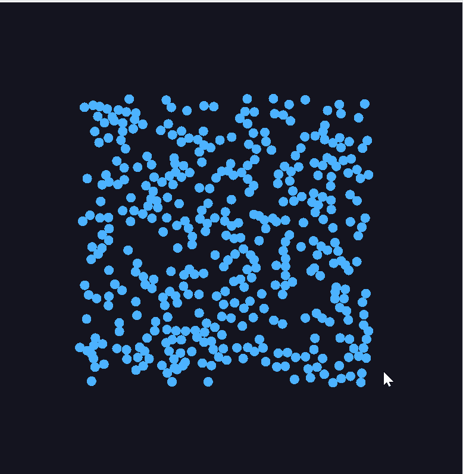

# CG-Lab: 2D 粒子物理系统

实现了一个基于 Taichi 语言的高性能 2D 粒子仿真系统，模拟了真实物理环境中的粒子交互。

##  运行演示


##  核心特性
* **并行计算**：利用 Taichi 的并行计算能力，支持大规模粒子实时仿真。
* **物理逻辑**：
  * **非弹性碰撞**：实现了基于动量守恒的球体碰撞响应。
  * **鼠标引力**：通过计算粒子与鼠标坐标的矢量差，实时施加向心加速度。
  * **能量损耗**：模拟空气阻力或不完全弹性碰撞导致的动能衰减。
* **稳定性优化**：引入位置修正算法，解决了粒子重叠导致的数值爆炸问题。
* **核心优势**：相比课件所给代码，增添了每个粒子之间碰撞的模拟，更加真实。

##  快速开始
使用 `uv` 管理环境：
```powershell
uv run -m src.work0.main
```
## 备注
* **粒子加速**:阻力改为0.98
* **弹性碰撞**： 球体间碰撞改为1
* **解决粒子拥挤**：边界碰撞损失改为-0.9，建议搭配另外两条备注使用。
